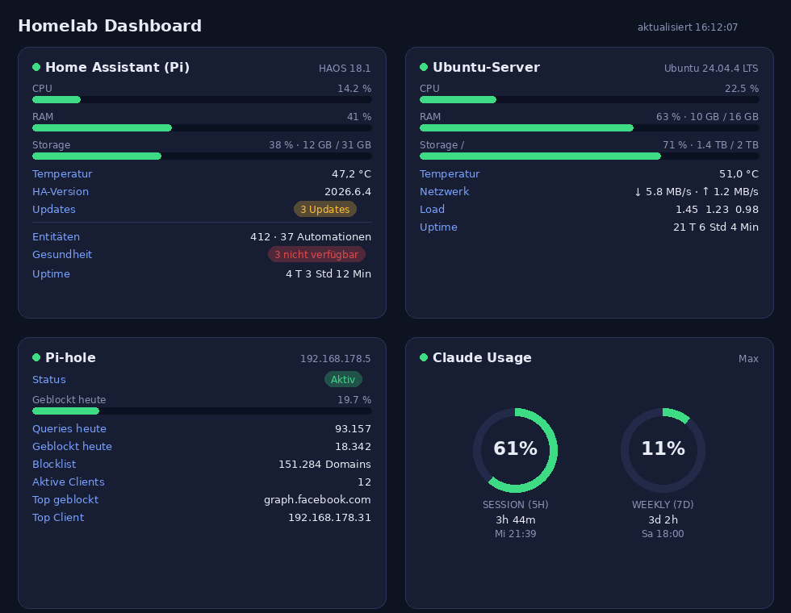

# Homelab Dashboard

Ein kleines **Home-Assistant-Add-on**, das drei Server auf einen Blick zusammenfasst –
**HASS-Pi**, **Ubuntu-Server** und **Pi-hole** – plus eine **Claude-Usage**-Kachel.
Läuft als Ingress-Panel direkt in der HA-Seitenleiste (HA-Login, kein offener Port).

## Was es zeigt

- **Pro Server:** CPU, Temperatur, RAM, Storage, Netzwerk, Uptime, OS, verfügbare Updates
- **Pi-hole (PADD-artig):** Status, Queries/geblockt heute, Blocklist-Größe, Top-Client & -Domain
- **Home Assistant:** Version, Core-/OS-/Add-on-Updates, Entitäten- & Automations-Zähler, Health
- **Claude Usage:** Session (5 h) & Weekly (7 d) als Ringe mit Reset-Countdown

## Installation

Als Add-on-Repository einbinden: in HA **Add-on-Store → ⋮ → Repositories →**
`https://github.com/<DEIN-USER>/homelab-dashboard` **→ Hinzufügen → Installieren**,
dann in den **Optionen** IPs und Pi-hole-App-Passwort eintragen.

Vollständige Anleitung (Glances, Claude-Usage-Exporter, Systemmonitor):
**[homelab_dashboard/DOCS.md](homelab_dashboard/DOCS.md)**

## Aufbau

- `homelab_dashboard/` – das Add-on (FastAPI-Aggregator + dependency-freies Frontend)
- `ubuntu-server/` – Glances-Dienst & Claude-Usage-Exporter für den Ubuntu-Server

## Sicherheit

Keine Geheimnisse im Repo: Pi-hole-Passwort und Claude-Token werden nur zur Laufzeit
gelesen (Add-on-Optionen bzw. `~/.claude`). Die IPs in `config.yaml` sind Platzhalter.

## Lizenz

[MIT](LICENSE)
