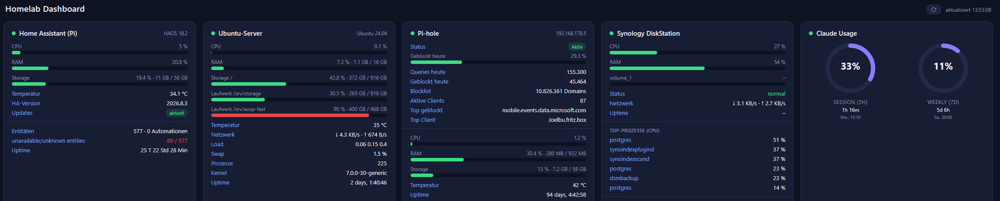

# Homelab Dashboard

Ein kleines **Home-Assistant-Add-on**, das drei Server auf einen Blick zusammenfasst –
**HASS-Pi**, **Ubuntu-Server** und **Pi-hole** – plus eine **Claude-Usage**-Kachel und
einen optionalen **Webseiten-Status**.
Läuft als Ingress-Panel direkt in der HA-Seitenleiste (HA-Login, kein offener Port).

## Was es zeigt

- **Pro Server:** CPU, Temperatur, RAM, Storage (inkl. weiterer Volumes), Netzwerk, Uptime, OS, Kernel
- **Pi-hole:** Status, Queries/geblockt heute, Blocklist-Größe, Top-Client & -Domain –
  **plus die Hardware des Pi-hole-Raspi** (CPU/RAM/Storage/Temp/Uptime)
- **Home Assistant:** Version, Core-/OS-/Add-on-Updates, Entitäten- & Automations-Zähler,
  „unavailable/unknown entities"
- **Claude Usage:** Session (5 h) & Weekly (7 d) als Ringe mit Reset-Countdown
- **Webseite (optional):** Online/Offline, HTTP-Code und Antwortzeit einer frei
  konfigurierbaren URL
- **Refresh-Button** oben rechts für sofortige Aktualisierung

## Installation

Als Add-on-Repository einbinden: in HA **Apps → App installieren → ⋮ → Repositories →
„+ Hinzufügen" →** `https://github.com/GarageMan/Homelab_Dashboard`
**→ Hinzufügen → Installieren**, dann in den **Optionen** IPs, Pi-hole-App-Passwort und
ggf. die Webseiten-URL eintragen.

Vollständige Anleitung (Glances, Claude-Usage-Exporter, Systemmonitor):
**[homelab_dashboard/DOCS.md](homelab_dashboard/DOCS.md)**

## Aufbau

- `homelab_dashboard/` – das Add-on (FastAPI-Aggregator + dependency-freies Frontend)
- `ubuntu-server/` – Glances-Dienst, Claude-Usage-Exporter und die Token-Erneuerungs-Routine

## Sicherheit

Keine Geheimnisse im Repo: Pi-hole-Passwort und Claude-Token werden nur zur Laufzeit
gelesen (Add-on-Optionen bzw. `token.env`/`~/.claude`). Die IPs in `config.yaml` sind
Platzhalter.

## Lizenz

[MIT](LICENSE)
